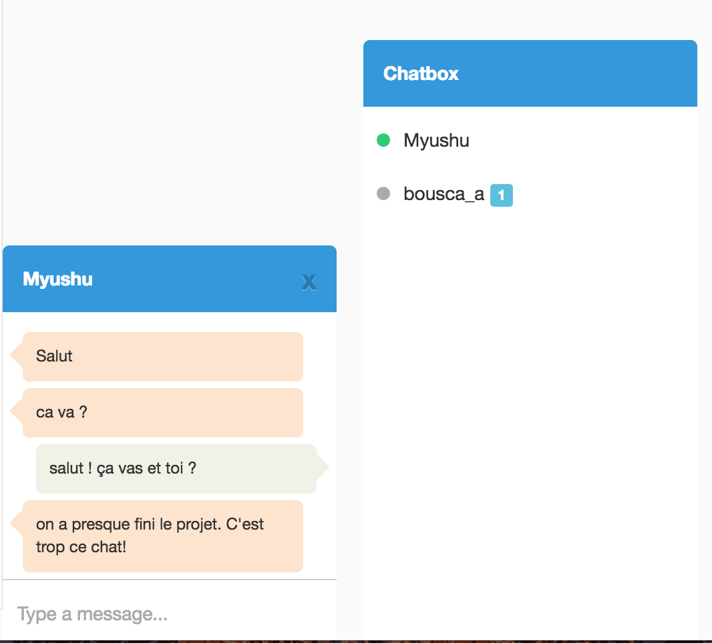
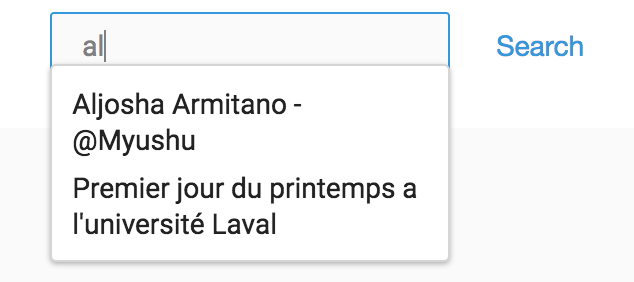
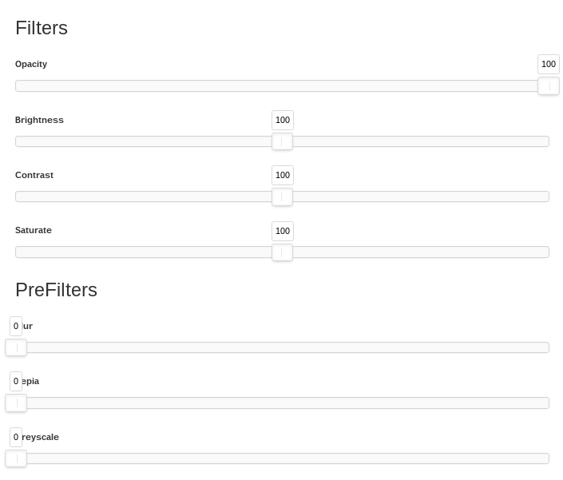
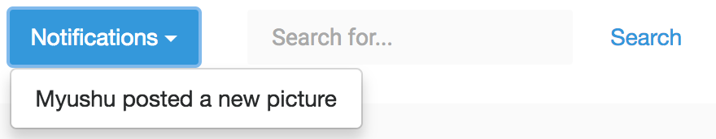

# Ugram
The instagram like made by the **team 06** for [GLO-3312](https://github.com/GLO3112) on wither 2017.  

[](https://travis-ci.com/GLO3102/ugram-h17-team-06)


## About Project

**AWS Links :**
- [The Front-end](http://laval-ugram-team-06.s3-website-us-east-1.amazonaws.com)
- [The Back-end](http://ugram-team6.us-east-1.elasticbeanstalk.com)

**API :**
- [API documentation](http://docs.ugram06.apiary.io)

## Project Configuration

### Front end
The compressed and minified files are in frontend/src/dist  
Generate minified files:
``````
ng build --prod
``````
Running project locally (localhost:4200):
```
npm start
```

### Back end

To run the server, set information on the config file ``` backend/config/default.json```.   
You also must start the [redis](redis.io) database : 
```
sudo service redis start
```
If you want ton init the database, you must run : 
```
cd backend
npm run-script initialize
```
Then you can start the server :
```
npm start
```

## Project implémentation
### Front end
The frontend is based on [Angular 2](https://angular.io). 
The rest library is [ng2-resource-rest](https://github.com/troyanskiy/ng2-resource-rest).
The guideline is the [Angular 2 official](https://angular.io/styleguide).

### Back end
The server is based on [express](http://expressjs.com/). The token manager is [jwt](http://jwt.io). The logger is [Winston](https://github.com/lazywithclass/winston-cloudwatch). The MySQL driver is [mysql](https://www.npmjs.com/package/mysql). The [Redis](redis.io) driver is [redis](https://www.npmjs.com/package/redis).
The SQL orm is [sequelize](http://docs.sequelizejs.com/en/v3/). The models are stored on ```backend/src/models```. To regenerate the models, run :
```
backend/dist/generate_models.sh 
```
The services are stored on ```backend/src/services``` and controllers on ```backend/src/controllers```. The common folder (```backend/src/common```) contains the services using by other services such as the orm or the configuration file manager.

## Bonus
For the last release, we implemented few bonus :
 - A tchat to talk with your friends   
 - An Autocompletion on the search bar   
 - Some Filters when you post a new picture  
 - A following system  
 
### The tchat
On your rigth side you have the tchat scrollable panel.  
When your friend is connected, he have a green ligth , otherwhise it's should grey . When you click on a username, a text will open. You can see your old conversation and you can send a new message.  
When you recevied a new message, the page's title is updated like this : `(1) Ugram`. And you should be seen a warning box next to the sender name with the numner of new message.  


### The Autocompletion on the search bar  
On rigth top side, you should see a search bar. When you started typping a autocompletion combox will appered. You can find by user, hashtag or word on description.  


### The Filters
When your upload a picture you can some filters :



### The following system.
On your friend's page you can a see a following button . You can also see his number of followers and following. When your are a follower, you will received a notification when he post a new picture.  

